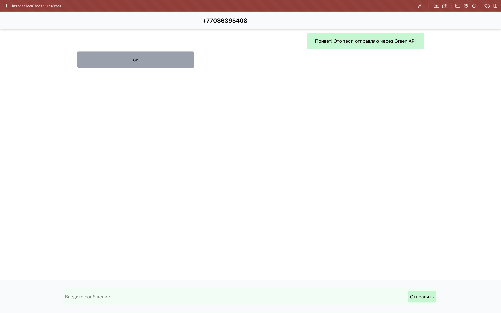

# Тестовое задание на позицию Frontend developer в Green API

## Установка

- Скачать / склонировать репозиторий 
```cmd
git clone https://github.com/ddmitriylee/green-api.git
```

- Скачать все зависимости
```cmd
cd green-api
npm install
```

- Запустить Проект
```
npm run dev
```

## Стек

### Использованные технологии:

- React
- Redux 
- Tailwind

## Скриншоты Проекта


